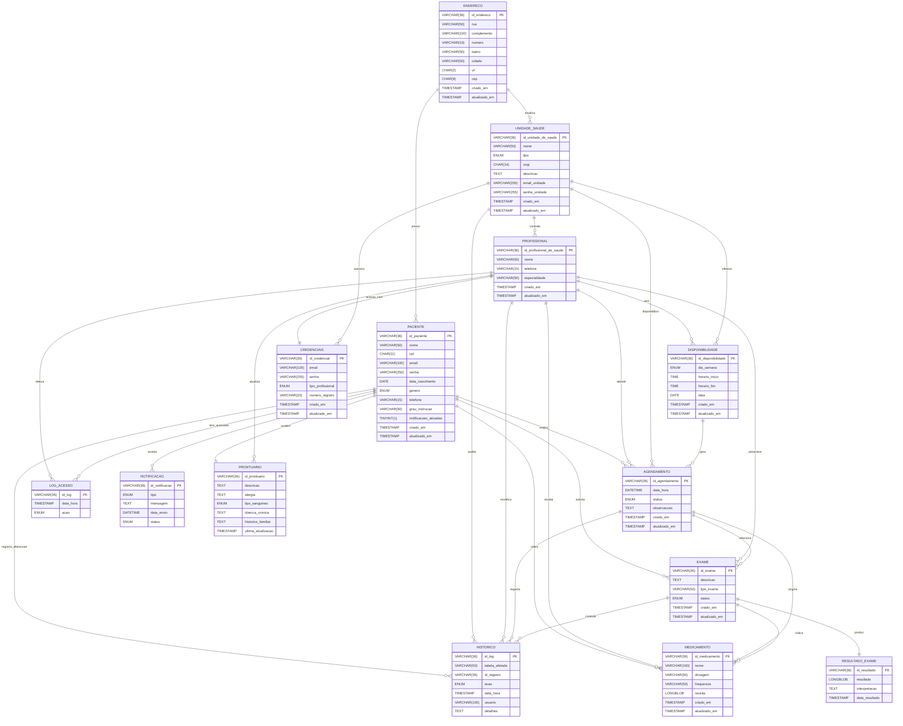

# 📌 Sistema de Agendamento a Saúde

<p> Somos a SAS (Sistema de Agendamento de Saúde), uma startup de tecnologia dedicada a transformar a experiência na área da saúde por meio de soluções digitais inovadoras. Nosso propósito é simplificar e agilizar o agendamento e o atendimento médico, proporcionando praticidade para os pacientes e eficiência para os profissionais da saúde.

<b>Praticidade para Pacientes:</b> Agendamento rápido, acesso a prontuários digitais e informações centralizadas.

<b>Eficiência para Profissionais:</b> Gestão simplificada de consultas, integração de históricos médicos e otimização de
processos.

<b>Inovação Contínua:</b> Soluções personalizadas e atualizadas para atender às necessidades do setor de saúde.

Na SAS, acreditamos que a tecnologia pode ser uma grande aliada para melhorar a saúde e o bem-estar da sociedade.

# 🚀 Tecnologias Utilizadas

- Frontend: HTML,CSS, Javascript e React.js
- Backend: Java (Spring Boot)
- Banco de Dados: MySQL
- Notificações: SMS/WhatsApp
- Docker

# 📑 Modelo Entidade de Relacionamento (EER)



# 📦 Instalação e Configuração

🔧 Pré-requisitos
Antes de começar, certifique-se de ter as seguintes ferramentas instaladas:

- Node.js
- Java JDK 21
- MySQL
- Docker
- React.js

# 🎯 Passos para rodar o projeto🔹Backend (Java)

# 🔗 Clone o repositório

```git
git clone https://github.com/SAS-Organizacao/SAS_BackEnd
```

# 🛠️ Endpoints da API

<p>Em construção...</p>

# 📌 Autenticação

<p>Em construção...</p>

# 📌 Agendamentos

<p>Em construção...</p>

# 📌 Prontuário

<p>Em construção...</p>

# 📌 Contato

📧Email: sas@gmail.com

🌐Site: www.sas.com.br

# Integrantes

</tr>
  <tr align=center>
    <td>
      <a href="https://github.com/DGuabiraba">
        
      </a>
    </td>
    <td>
      <a href="https://github.com/Gabrielteles001">
        
      </a>
    </td>
    <td>
      <a href="https://github.com/WalterSantos08">
        
      </a>
    </td>
    <td>
      <a href="https://github.com/LeonardoIrineu">
        
      </a>
    </td>
    <td>
      <a href="https://github.com/dorotrodrigues">
        
      </a>
    </td>
    <td>
      <a href="https://github.com/alvesrafaelaa">
        
      </a>
    </td>
    <td>
      <a href="https://github.com/CeloDigital">
        
      </a>
    </td>
     <td>
      <a href="https://github.com/mattheus536">
        
      </a>
    </td>
    
    
