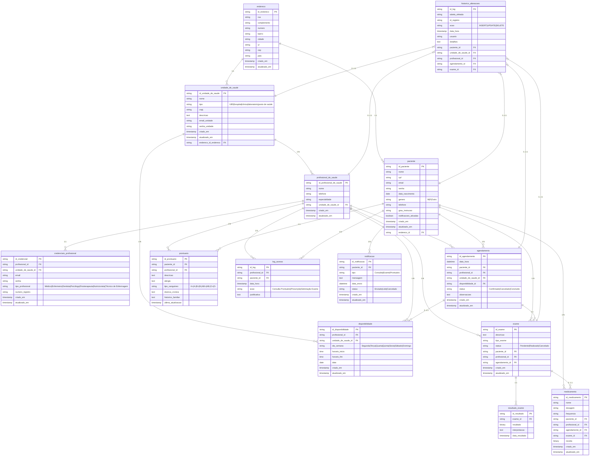

# 📌 Sistema de Agendamento a Saúde

<p> Somos a SAS (Sistema de Agendamento de Saúde), uma startup de tecnologia dedicada a transformar a experiência na área da saúde por meio de soluções digitais inovadoras. Nosso propósito é simplificar e agilizar o agendamento e o atendimento médico, proporcionando praticidade para os pacientes e eficiência para os profissionais da saúde.

<b>Praticidade para Pacientes:</b> Agendamento rápido, acesso a prontuários digitais e informações centralizadas.

<b>Eficiência para Profissionais:</b> Gestão simplificada de consultas, integração de históricos médicos e otimização de
processos.

<b>Inovação Contínua:</b> Soluções personalizadas e atualizadas para atender às necessidades do setor de saúde.

Na SAS, acreditamos que a tecnologia pode ser uma grande aliada para melhorar a saúde e o bem-estar da sociedade.

# 🚀 Tecnologias Utilizadas

- Frontend: HTML,CSS, Javascript e React.js
- Backend: Java (Spring Boot)
- Banco de Dados: MySQL
- Notificações: SMS/WhatsApp
- Docker

# 📑 Modelo Entidade de Relacionamento (EER)


```mermaid
erDiagram
    endereco ||--o{ paciente : "1:1"
    endereco ||--o{ unidade_de_saude : "1:1"
    unidade_de_saude ||--o{ profissional_de_saude : "1:N"
    unidade_de_saude ||--o{ disponibilidade : "1:N"
    profissional_de_saude ||--o{ disponibilidade : "1:N"
    profissional_de_saude ||--o{ credenciais_profissional : "1:1"
    profissional_de_saude ||--o{ agendamento : "1:N"
    profissional_de_saude ||--o{ prontuario : "1:N"
    profissional_de_saude ||--o{ exame : "1:N"
    profissional_de_saude ||--o{ log_acesso : "1:N"
    paciente ||--o{ agendamento : "1:N"
    paciente ||--o{ prontuario : "1:1"
    paciente ||--o{ exame : "1:N"
    paciente ||--o{ notificacao : "1:N"
    paciente ||--o{ log_acesso : "1:N"
    paciente ||--o{ medicamento : "1:N"
    agendamento ||--o{ exame : "1:1"
    agendamento ||--o{ disponibilidade : "0..1:1"
    exame ||--o{ resultado_exame : "1:1"
    exame ||--o{ medicamento : "0..1:1"
    historico_alteracoes }|--|| paciente : "0..1:1"
    historico_alteracoes }|--|| unidade_de_saude : "0..1:1"
    historico_alteracoes }|--|| profissional_de_saude : "0..1:1"
    historico_alteracoes }|--|| agendamento : "0..1:1"
    historico_alteracoes }|--|| exame : "0..1:1"

    endereco {
        string id_endereco PK
        string rua
        string complemento
        string numero
        string bairro
        string cidade
        string uf
        string cep
        string pais
        timestamp criado_em
        timestamp atualizado_em
    }

    paciente {
        string id_paciente PK
        string nome
        string cpf
        string email
        string senha
        date data_nascimento
        string genero "M|F|Outro"
        string telefone
        string grau_instrucao
        boolean notificacoes_ativadas
        timestamp criado_em
        timestamp atualizado_em
        string endereco_id FK
    }

    unidade_de_saude {
        string id_unidade_de_saude PK
        string nome
        string tipo "UBS|hospital|clinica|laboratorio|posto de saúde"
        string cnpj
        text descricao
        string email_unidade
        string senha_unidade
        timestamp criado_em
        timestamp atualizado_em
        string endereco_id_endereco FK
    }

    profissional_de_saude {
        string id_profissional_de_saude PK
        string nome
        string telefone
        string especialidade
        string unidade_de_saude_id FK
        timestamp criado_em
        timestamp atualizado_em
    }

    disponibilidade {
        string id_disponibilidade PK
        string profissional_id FK
        string unidade_de_saude_id FK
        string dia_semana "Segunda|Terça|Quarta|Quinta|Sexta|Sábado|Domingo"
        time horario_inicio
        time horario_fim
        date data
        timestamp criado_em
        timestamp atualizado_em
    }

    agendamento {
        string id_agendamento PK
        datetime data_hora
        string paciente_id FK
        string profissional_id FK
        string unidade_de_saude_id FK
        string disponibilidade_id FK
        string status "Confirmado|Cancelado|Concluído"
        text observacoes
        timestamp criado_em
        timestamp atualizado_em
    }

    credenciais_profissional {
        string id_credencial PK
        string profissional_id FK
        string unidade_de_saude_id FK
        string email
        string senha
        string tipo_profissional "Médico|Enfermeiro|Dentista|Psicólogo|Fisioterapeuta|Nutricionista|Técnico de Enfermagem"
        string numero_registro
        timestamp criado_em
        timestamp atualizado_em
    }

    exame {
        string id_exame PK
        text descricao
        string tipo_exame
        string status "Pendente|Realizado|Cancelado"
        string paciente_id FK
        string profissional_id FK
        string agendamento_id FK
        timestamp criado_em
        timestamp atualizado_em
    }

    historico_alteracoes {
        string id_log PK
        string tabela_afetada
        string id_registro
        string acao "INSERT|UPDATE|DELETE"
        timestamp data_hora
        string usuario
        text detalhes
        string paciente_id FK
        string unidade_de_saude_id FK
        string profissional_id FK
        string agendamento_id FK
        string exame_id FK
    }

    log_acesso {
        string id_log PK
        string profissional_id FK
        string paciente_id FK
        timestamp data_hora
        string acao "Consulta Prontuário|Prescrição|Solicitação Exame"
        text justificativa
    }

    medicamento {
        string id_medicamento PK
        string nome
        string dosagem
        string frequencia
        string paciente_id FK
        string profissional_id FK
        string agendamento_id FK
        string exame_id FK
        binary receita
        timestamp criado_em
        timestamp atualizado_em
    }

    notificacao {
        string id_notificacao PK
        string paciente_id FK
        string tipo "Consulta|Exame|Prontuário"
        text mensagem
        datetime data_envio
        string status "Enviado|Lido|Cancelado"
        timestamp criado_em
        timestamp atualizado_em
    }

    prontuario {
        string id_prontuario PK
        string paciente_id FK
        string profissional_id FK
        text descricao
        text alergia
        string tipo_sanguineo "A+|A-|B+|B-|AB+|AB-|O+|O-"
        text doenca_cronica
        text historico_familiar
        timestamp ultima_atualizacao
    }

    resultado_exame {
        string id_resultado PK
        string exame_id FK
        binary resultado
        text interpretacao
        timestamp data_resultado
    }
```

# 📦 Instalação e Configuração

🔧 Pré-requisitos
Antes de começar, certifique-se de ter as seguintes ferramentas instaladas:

- Node.js
- Java JDK 21
- MySQL
- Docker
- React.js

# 🎯 Passos para rodar o projeto🔹Backend (Java)

# 🔗 Clone o repositório

```git
git clone https://github.com/SAS-Organizacao/SAS_BackEnd
```

# 🛠️ Endpoints da API

<p>Em construção...</p>

# 📌 Autenticação

<p>Em construção...</p>

# 📌 Agendamentos

<p>Em construção...</p>

# 📌 Prontuário

<p>Em construção...</p>

# 📌 Contato

📧Email: sas@gmail.com

🌐Site: www.sas.com.br

# Integrantes

</tr>
  <tr align=center>
    <td>
      <a href="https://github.com/DGuabiraba">
        
      </a>
    </td>
    <td>
      <a href="https://github.com/Gabrielteles001">
        
      </a>
    </td>
    <td>
      <a href="https://github.com/WalterSantos08">
        
      </a>
    </td>
    <td>
      <a href="https://github.com/LeonardoIrineu">
        
      </a>
    </td>
    <td>
      <a href="https://github.com/dorotrodrigues">
        
      </a>
    </td>
    <td>
      <a href="https://github.com/alvesrafaelaa">
        
      </a>
    </td>
    <td>
      <a href="https://github.com/CeloDigital">
        
      </a>
    </td>
     <td>
      <a href="https://github.com/mattheus536">
        
      </a>
    </td>
    
    
